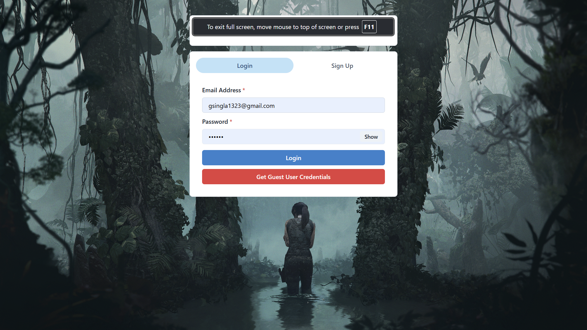
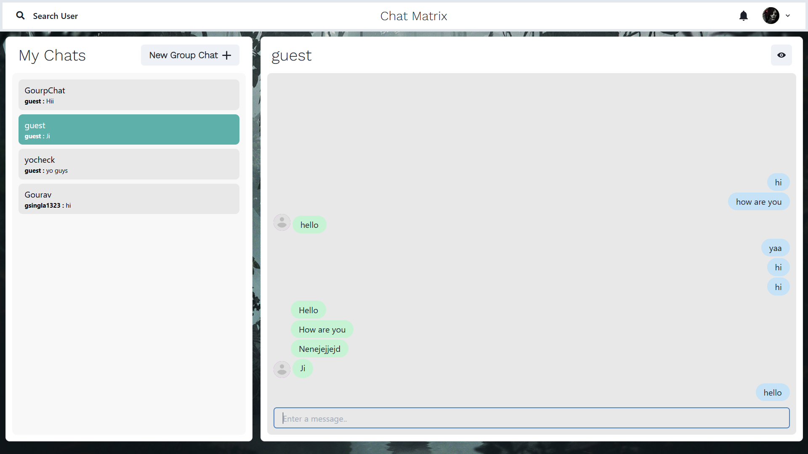

# ChatMapp 💬

[](https://chatmapp.onrender.com/)
[](LICENSE)
[](https://nodejs.org/)
[](https://reactjs.org/)

A modern, full-stack real-time chat application built with the MERN stack (MongoDB, Express.js, React, Node.js). ChatMapp provides seamless real-time communication with a beautiful, responsive interface powered by Chakra UI and Socket.io.

## 🌐 Live Demo

**Production URL:** [https://chatmapp.onrender.com/](https://chatmapp.onrender.com/)

## 📸 Screenshots


_Main chat interface with real-time messaging_


_Secure authentication system_


_Group chat functionality_

## ✨ Features

### 🔐 Authentication & Security

- Secure user registration and login
- JWT (JSON Web Token) based authentication
- Password encryption with bcrypt
- Protected routes and middleware

### 💬 Real-time Messaging

- Instant messaging with Socket.io
- Real-time message delivery
- Typing indicators
- Message notifications
- Online/offline status

### 👥 Chat Management

- One-on-one private chats
- Group chat creation and management
- User search functionality
- Chat history persistence
- Message timestamps

### 🎨 User Interface

- Modern, responsive design with Chakra UI
- Dark/light theme support
- Mobile-friendly interface
- Smooth animations with Framer Motion
- Intuitive user experience

### 🔍 Advanced Features

- User profile management
- Group chat administration
- Real-time user search
- Message status indicators
- Emoji support

## 🚀 Quick Start

### Prerequisites

Before running this application, make sure you have the following installed:

- [Node.js](https://nodejs.org/) (v14 or higher)
- [MongoDB](https://www.mongodb.com/) (local installation or MongoDB Atlas)
- [Git](https://git-scm.com/)

### Installation

1. **Clone the repository**

   ```bash
   git clone https://github.com/Gourav830/chatMapp.git
   cd chatMapp
   ```

2. **Install backend dependencies**

   ```bash
   npm install --legacy-peer-deps
   ```

3. **Install frontend dependencies**

   ```bash
   cd frontend
   npm install --legacy-peer-deps
   cd ..
   ```

4. **Environment Configuration**

   Create a `.env` file in the root directory:

   ```env
   # Server Configuration
   PORT=5000
   NODE_ENV=development

   # Database Configuration
   MONGO_URI=your_mongodb_connection_string

   # JWT Configuration
   JWT_SECRET=your_jwt_secret_key
   ```

   **Environment Variables Explained:**

   - `PORT`: Server port (default: 5000)
   - `NODE_ENV`: Environment mode (development/production)
   - `MONGO_URI`: MongoDB connection string
   - `JWT_SECRET`: Secret key for JWT token generation

### Running the Application

#### Development Mode

1. **Start the backend server**

   ```bash
   npm run server
   ```

2. **Start the frontend development server** (in a new terminal)

   ```bash
   npm run client
   ```

3. **Start both servers concurrently**

   ```bash
   npm run dev
   ```

The application will be available at:

- Frontend: `http://localhost:3000`
- Backend API: `http://localhost:5000`

#### Production Mode

1. **Build the frontend**

   ```bash
   npm run build
   ```

2. **Start the production server**

   ```bash
   npm start
   ```

## 🏗️ Project Structure

```text
chatMapp/
├── backend/                    # Backend server code
│   ├── config/                # Configuration files
│   │   ├── db.js             # Database connection
│   │   └── generateToken.js   # JWT token utilities
│   ├── controllers/           # Route controllers
│   │   ├── chatControllers.js
│   │   ├── messageControllers.js
│   │   └── userControllers.js
│   ├── middleware/            # Custom middleware
│   │   ├── authMiddleware.js
│   │   └── errorMiddleware.js
│   ├── models/               # Database models
│   │   ├── chatModel.js
│   │   ├── messageModel.js
│   │   └── userModel.js
│   ├── routes/               # API routes
│   │   ├── chatRoutes.js
│   │   ├── messageRoutes.js
│   │   └── userRoutes.js
│   └── server.js            # Main server file
├── frontend/                # React frontend
│   ├── public/             # Static assets
│   ├── src/               # Source code
│   │   ├── components/    # React components
│   │   ├── config/       # Frontend configuration
│   │   ├── Context/      # React context
│   │   └── Pages/        # Page components
│   └── package.json
├── screenshots/           # Application screenshots
├── package.json          # Backend dependencies
└── README.md            # Project documentation
```

## 🛠️ Technology Stack

### Backend Technologies

- **Node.js** - JavaScript runtime environment
- **Express.js** - Web application framework
- **MongoDB** - NoSQL database
- **Mongoose** - MongoDB object modeling
- **Socket.io** - Real-time bidirectional event-based communication
- **JWT** - JSON Web Tokens for authentication
- **bcrypt.js** - Password hashing library

### Frontend Technologies

- **React** - JavaScript library for building user interfaces
- **Chakra UI** - Modular and accessible component library
- **Socket.io Client** - Real-time communication client
- **Axios** - HTTP client for API requests
- **React Router** - Declarative routing for React
- **Framer Motion** - Animation library

### Development Tools

- **Nodemon** - Development server with auto-restart
- **dotenv** - Environment variable management
- **Concurrently** - Run multiple commands concurrently

## 📋 Available Scripts

### Backend Scripts

```bash
npm start          # Start production server
npm run server     # Start development server with nodemon
npm run build      # Install dependencies and build frontend
```

### Frontend Scripts

```bash
npm start          # Start development server
npm run build      # Build for production
npm test           # Run tests
npm run eject      # Eject from Create React App
```

## 🔧 API Endpoints

### Authentication Routes

- `POST /api/user/register` - Register a new user
- `POST /api/user/login` - Login user
- `GET /api/user` - Search users (protected)

### Chat Routes

- `POST /api/chat` - Create or fetch one-on-one chat (protected)
- `GET /api/chat` - Fetch all chats for user (protected)
- `POST /api/chat/group` - Create group chat (protected)
- `PUT /api/chat/rename` - Rename group chat (protected)
- `PUT /api/chat/groupremove` - Remove user from group (protected)
- `PUT /api/chat/groupadd` - Add user to group (protected)

### Message Routes

- `POST /api/message` - Send message (protected)
- `GET /api/message/:chatId` - Fetch all messages for chat (protected)

## 🔒 Authentication Flow

1. **User Registration/Login**

   - User provides email and password
   - Password is hashed using bcrypt
   - JWT token is generated and returned

2. **Protected Routes**

   - JWT token is sent in Authorization header
   - Middleware verifies token and extracts user info
   - User info is attached to request object

3. **Frontend Authentication**
   - Token is stored in localStorage
   - Axios interceptor adds token to requests
   - Protected routes redirect unauthenticated users

## 🌐 Socket.io Events

### Client to Server Events

- `setup` - Initialize user connection
- `join chat` - Join a specific chat room
- `typing` - User started typing
- `stop typing` - User stopped typing
- `new message` - Send new message

### Server to Client Events

- `connected` - Connection established
- `message received` - New message received
- `typing` - Someone is typing
- `stop typing` - Someone stopped typing

## 📦 Dependencies

### Backend Dependencies

```json
{
  "bcryptjs": "^2.4.3", // Password hashing
  "colors": "^1.4.0", // Console colors
  "dotenv": "^9.0.2", // Environment variables
  "express": "^4.17.1", // Web framework
  "express-async-handler": "^1.1.4", // Async error handling
  "jsonwebtoken": "^8.5.1", // JWT implementation
  "mongoose": "^5.12.9", // MongoDB ODM
  "nodemon": "^2.0.7", // Development server
  "socket.io": "^4.1.2" // Real-time communication
}
```

### Frontend Dependencies

```json
{
  "@chakra-ui/icons": "^1.0.13", // Chakra UI icons
  "@chakra-ui/react": "^1.6.2", // UI component library
  "@emotion/react": "^11", // CSS-in-JS library
  "@emotion/styled": "^11", // Styled components
  "axios": "^0.21.1", // HTTP client
  "framer-motion": "^4", // Animation library
  "react": "^17.0.2", // React library
  "react-chips": "^0.8.0", // Chip component
  "react-dom": "^17.0.2", // React DOM
  "react-lottie": "^1.2.3", // Lottie animations
  "react-notification-badge": "^1.5.1", // Notification badges
  "react-router-dom": "^5.2.0", // Routing
  "react-scrollable-feed": "^1.3.1", // Scrollable chat feed
  "socket.io-client": "^4.1.2" // Socket.io client
}
```

## 🐛 Troubleshooting

### Common Issues

1. **MongoDB Connection Error**

   ```text
   Error: MongoNetworkError: failed to connect to server
   ```

   **Solution:** Check your MongoDB connection string and ensure MongoDB is running.

2. **JWT Secret Missing**

   ```text
   Error: JWT_SECRET is not defined
   ```

   **Solution:** Add `JWT_SECRET` to your `.env` file.

3. **Port Already in Use**

   ```text
   Error: listen EADDRINUSE :::5000
   ```

   **Solution:** Change the port in `.env` or kill the process using the port.

4. **Frontend Build Issues**

   ```text
   npm ERR! peer dep missing
   ```

   **Solution:** Use `npm install --legacy-peer-deps` to resolve peer dependency conflicts.

### Debug Mode

To run the application in debug mode:

```bash
# Backend
DEBUG=* npm run server

# Frontend
npm start
```

## 🤝 Contributing

Contributions are welcome! Please feel free to submit a Pull Request. For major changes, please open an issue first to discuss what you would like to change.

### Development Workflow

1. Fork the repository
2. Create a feature branch (`git checkout -b feature/AmazingFeature`)
3. Commit your changes (`git commit -m 'Add some AmazingFeature'`)
4. Push to the branch (`git push origin feature/AmazingFeature`)
5. Open a Pull Request

### Code Style

- Use consistent indentation (2 spaces)
- Follow React best practices
- Write meaningful commit messages
- Add comments for complex logic

## 📄 License

This project is licensed under the ISC License. See the [LICENSE](LICENSE) file for details.

## 👨‍💻 Author

### Gourav Singla

- GitHub: [@Gourav830](https://github.com/Gourav830)
- LinkedIn: [Connect with me](https://linkedin.com/in/yourprofile)

## 🙏 Acknowledgments

- Thanks to the MERN stack community for excellent documentation
- Chakra UI for the beautiful component library
- Socket.io for real-time communication capabilities
- All contributors who helped improve this project

## 📞 Support

If you have any questions or need help with setup, please:

1. Check the [Issues](https://github.com/Gourav830/chatMapp/issues) page
2. Create a new issue if your problem isn't listed
3. Provide detailed information about your environment and the issue

---

⭐ **Star this repository if you found it helpful!** ⭐
